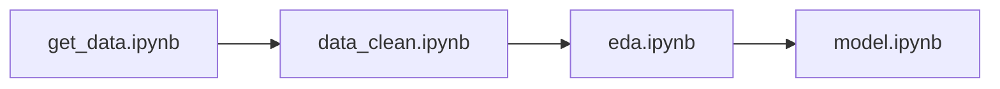

# Feature Engineering and Machine Learning Project 🎬📊

Projeto completo de Feature Engineering e Machine Learning aplicado à análise de filmes usando a API do TMDb (The Movie Database). O projeto implementa um pipeline completo desde a coleta de dados até o treinamento de modelos de classificação.

## 📋 Pré-requisitos

- Python 3.12 ou superior
- Git
- Pipenv ou venv (para gerenciamento de dependências)
- Chave de API do TMDb (gratuita)

## ✨ Tecnologias Utilizadas

- **Python 3.12** - Linguagem principal
- **Pandas** - Manipulação e análise de dados
- **NumPy** - Computação científica
- **Scikit-learn** - Machine Learning
- **Matplotlib & Seaborn** - Visualização de dados
- **Requests** - Consumo da API TMDb
- **Jupyter Notebooks** - Desenvolvimento interativo
- **Ruff** - Linting e formatação

## 🔧 Instalação e Configuração

### 1. Clone o repositório

```bash
git clone https://github.com/Rhogger/feature-eng-and-ml.git
cd feature-eng-and-ml
```

### 2. Configure o ambiente virtual

Escolha uma das opções abaixo:

#### Opção A: Usando Pipenv (Recomendado)

```bash
# Instale o Pipenv (se não tiver instalado)
pip install pipenv

# Instale as dependências
pipenv install

# Ative o ambiente virtual
pipenv shell
```

#### Opção B: Usando venv

```bash
# Crie o ambiente virtual
python -m venv venv

# Ative o ambiente virtual
# Linux/Mac:
source venv/bin/activate
# Windows:
# venv\Scripts\activate

# Instale as dependências
pip install -r requirements.txt
```

### 3. Configure as variáveis de ambiente

1. Crie um arquivo `.env` na raiz do projeto:

```bash
# Crie o arquivo .env
touch .env
```

1. Adicione suas credenciais da API TMDb:

```env
TMDB_API_KEY=sua_chave_api_aqui
BASE_URL=https://api.themoviedb.org/3
```

> 💡 **Como obter a chave da API TMDb:**
>
> 1. Acesse [TMDb](https://www.themoviedb.org/)
> 2. Crie uma conta gratuita
> 3. Vá em Configurações > API
> 4. Solicite uma chave de API
> 5. Copie a chave e cole no arquivo `.env`

## 📁 Estrutura do Projeto

```text
feature-eng-and-ml/
├── ia/                        # Modelos de IA e notebooks
│   └── src/
│       ├── constants/         # Constantes do projeto
│       │   ├── __init__.py   # Exporta todas as constantes
│       │   ├── categorical_features.py
│       │   └── numerical_features.py
│       ├── datasets/          # Datasets gerados pelos notebooks
│       │   ├── movies.csv     # Dados brutos dos filmes
│       │   ├── data_clean.csv # Dados limpos
│       │   ├── eda.csv        # Dados após EDA
│       │   └── model.csv      # Dados preparados para ML
│       ├── models/            # Modelos treinados
│       │   └── model.pkl      # Modelo de classificação
│       └── notebooks/         # Jupyter Notebooks
│           ├── get_data.ipynb      # 1. Coleta de dados
│           ├── data_clean.ipynb    # 2. Limpeza de dados
│           ├── eda.ipynb           # 3. Análise exploratória
│           └── model.ipynb         # 4. Treinamento do modelo
├── .vscode/                   # Configurações do VS Code
├── .env                       # Variáveis de ambiente (criar manualmente)
├── .gitattributes            # Configuração para diffs do Git
├── .gitignore                # Arquivos ignorados pelo Git
├── Pipfile                   # Dependências do projeto
├── Pipfile.lock              # Lock das dependências
├── ruff.toml                 # Configuração do Ruff
└── README.md                 # Este arquivo
```

## 🚀 Como Executar o Projeto

### Pipeline de Execução dos Notebooks

O projeto segue uma pipeline sequencial onde cada notebook depende do anterior:



#### 1. **get_data.ipynb** - Coleta de Dados

```bash
# Navegue para o diretório dos notebooks
cd ia/src/notebooks

# Execute o Jupyter Lab/Notebook
jupyter lab get_data.ipynb
```

**O que faz:**

- Conecta com a API do TMDb
- Coleta dados de filmes populares
- Cria o DataFrame inicial
- Gera o arquivo `movies.csv`

#### 2. **data_clean.ipynb** - Limpeza de Dados

```bash
jupyter lab data_clean.ipynb
```

**O que faz:**

- Carrega os dados brutos de `movies.csv`
- Aplica limpeza e tratamento de valores ausentes
- Realiza engenharia de features básica
- Executa pipeline completo de ML
- Gera o arquivo `data_clean.csv`

#### 3. **eda.ipynb** - Análise Exploratória

```bash
jupyter lab eda.ipynb
```

**O que faz:**

- Carrega dados limpos de `data_clean.csv`
- Aplica engenharia de features avançada
- Realiza análise exploratória dos dados
- Prepara features para modelagem
- Gera o arquivo `eda.csv`

#### 4. **model.ipynb** - Treinamento do Modelo

```bash
jupyter lab model.ipynb
```

**O que faz:**

- Carrega dados preparados de `eda.csv`
- Treina modelo de classificação
- Avalia performance do modelo
- Salva modelo treinado em `model.pkl`
- Gera o arquivo `model.csv`

### Execução Completa da Pipeline

Para executar toda a pipeline de uma vez:

```bash
# 1. Ative o ambiente virtual
pipenv shell  # ou source venv/bin/activate

# 2. Navegue para o diretório dos notebooks
cd ia/src/notebooks

# 3. Execute os notebooks em sequência
jupyter nbconvert --execute get_data.ipynb
jupyter nbconvert --execute data_clean.ipynb
jupyter nbconvert --execute eda.ipynb
jupyter nbconvert --execute model.ipynb
```

## 📄 Licença

Este projeto está sob a licença MIT. Veja o arquivo `LICENSE` para mais detalhes.

---
